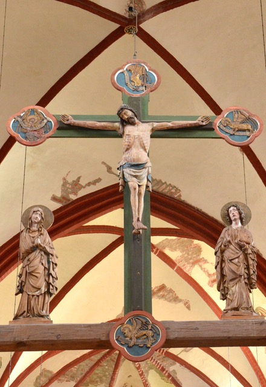

+++
title = 'Kreuz, auf das ich schaue'
publishDate = 2024-02-28 
date = 2024-03-01
expiryDate = 2024-05-15
draft = false
authors = ['eibisch']
heroCaption = 'Foto von Frank Eibisch'
heroStyle = 'background'
summary = ""
+++

## Bibelwort für den Monat März

> Entsetzt euch nicht! Ihr sucht Jesus von Nazareth,
den Gekreuzigten. Er ist auferstanden, er ist nicht hier.
>
> -- Markus 16,&#8239;6

## Kreuz, auf das ich schaue

Liebe Schwestern und Brüder! Liebe Freunde!

In der _Wiege von Brandenburg_ habe ich dieses Kreuz entdeckt,
im Dom _St.&#8239;Peter und Paul_ zu Brandenburg an der Havel. Es ist
ein Triumphkreuz aus der Gotik. An prominenter Stelle wurde
es hoch oben im Triumphbogen aufgerichtet. Christus ist weit
weg. Ich setze mich und blicke hinauf. Wer schaut sich schon
freiwillig den gefolterten und verspotteten Schmerzensmann an?
Anders als bei schrecklichen Bildern im Fernsehen kommen in der
Betrachtung meine Gedanken überraschender Weise zur Ruhe.

Ich sehe in der Figur einen Menschen, dem alles genommen
wurde: seine Würde, sein Leben. Und warum?


Jesus kommt Menschen nahe und passt doch nicht in die Welt. Damals nicht und heute nicht.


Der Tod von Jesus ist so sinnlos, wie jeder gewaltsame Tod sinnlos
ist. Das ist das Ende! Und doch bleibt der Tod nicht das Letzte,
was es über Jesus zu sagen gibt. »Gestorben, begraben, am 3.&#8239;Tage
auferstanden von den Toten…« Die Frauen am Grab werden am
Ostermorgen _von Hoffnung überrascht sein_[^1]. Und auch die Jünger.
Das Grün des Holzkreuzes ist die Farbe der Hoffnung, die Farbe
für Lebendigkeit.

»Entsetzt euch nicht! Ihr sucht Jesus von Nazareth, den Gekreuzigten.
Er ist auferstanden, er ist nicht hier.« (Markus 16,6) Was
für eine gute Nachricht! Jesus hat seine letzte Ruhe nicht im Grab
gefunden. Mir fällt das Grün des Holzkreuzes auf. Grün –
die Farbe für Lebendigkeit und Hoffnung. Hoffnungszeichen in der
Passions- und Osterzeit zu entdecken, dazu wünsche ich Ihnen eine
gesegnete Zeit. Vielleicht entdecken Sie, was dieser gekreuzigte
und auferstandene Jesus mit Ihnen zu tun hat.

Im Namen von Matthias Zieboll grüße ich Sie recht herzlich  
Ihre/Eure _Christin Eibisch_

> Kreuz, auf das ich schaue, steht als Zeichen da;  
der, dem ich vertraue, ist in dir mir nah.  
Kreuz, zu dem ich fliehe aus der Dunkelheit;  
statt der Angst und Mühe ist nun Hoffnungszeit.  
Kreuz, von dem ich gehe in den neuen Tag,  
bleib in meiner Nähe, dass ich nicht verzag.  
> 
> -- Eckart Bücken (Gesangbuch 213)

[^1]: so lautet ein Buchtitel darüber, was die Bibel zu Auferstehung und ewigen
Leben sagt.